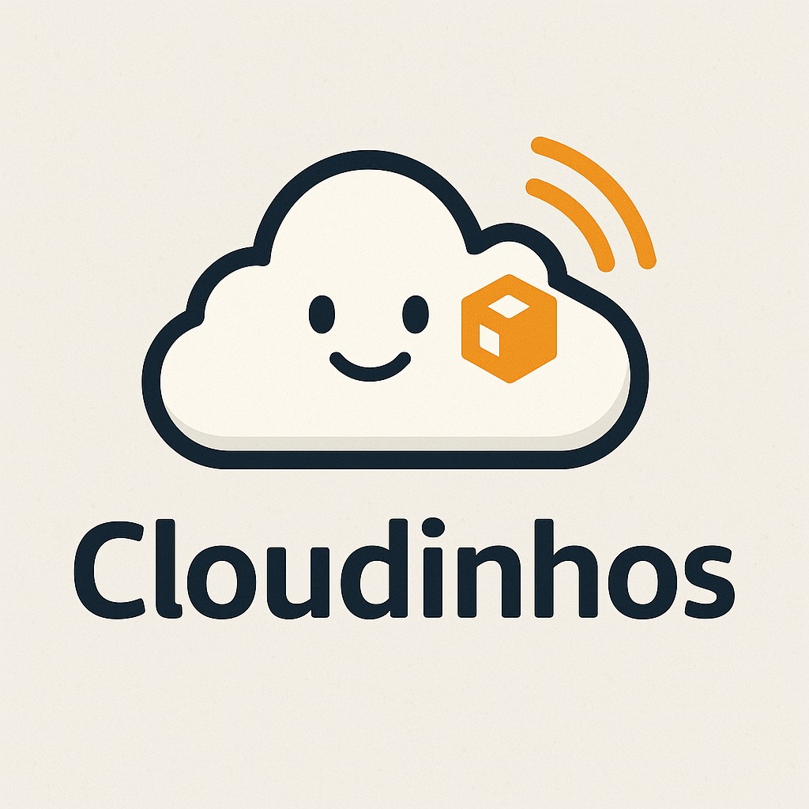

# 🛡️ Cloudinhos IA - Assistente Inteligente para Avaliação de Risco de Violência Doméstica

<div align="center">
  
</div>

## 📋 Sobre o Projeto

O **Cloudinhos IA** é uma aplicação web inteligente, discreta e acessível que utiliza Inteligência Artificial para auxiliar vítimas de violência doméstica e familiar contra a mulher. O sistema implementa o **FRIDA (Formulário Nacional de Risco e Proteção à Vida)**, desenvolvido pelo Conselho Nacional do Ministério Público (CNMP) em parceria com a União Europeia.

### 🎯 Objetivo Principal

Criar um sistema que permita às vítimas de violência doméstica conversar de forma segura e receber orientações qualificadas para solicitar assistência, sem gerar desconfiança, aumentando significativamente a probabilidade de intervenção e proteção eficazes no momento adequado.

### 🏆 Projeto Acadêmico

**Disciplina:** Inteligência Artificial  
**Turma:** BRSAO179  
**Grupo:** 04 (Cloudinhos)  
**Tema:** Violência Contra a Mulher  
**Instituição:** Escola da Nuvem

## ✨ Características Principais

- **🤖 IA Conversacional Humanizada**: Utiliza Amazon Bedrock com o modelo Claude Sonnet 4 para interações empáticas e acolhedoras
- **🔒 Segurança e Discrição**: Interface discreta que não levanta suspeitas
- **⚡ Avaliação Rápida de Risco**: Detecção eficiente com 2-3 perguntas-chave baseadas no protocolo FRIDA
- **🎯 Encaminhamentos Personalizados**: Sugestões específicas com localização geográfica dos órgãos de apoio
- **📍 Localização Inteligente**: Utiliza o Amazon Bedrock para encontrar serviços próximos (até 10km)
- **🔐 Autenticação Segura**: Sistema de login para proteção dos dados

## 🏗️ Arquitetura Técnica

### Tecnologias Utilizadas

- **Frontend**: Streamlit
- **Backend**: Python 3.12
- **IA**: Amazon Bedrock (Claude Sonnet 4)
- **Cloud**: AWS (Amazon Web Services)
- **Processamento de Documentos**: PyPDF2, pandas
- **Autenticação**: Sistema próprio com cookies seguros

### Estrutura do Projeto

```
Cloudinhos_projeto_AWS/
├── app.py                 # Aplicação principal Streamlit
├── functions.py           # Funções auxiliares e integração AWS
├── auth_middleware.py     # Middleware de autenticação
├── run.sh                # Script de execução
├── requirements.txt       # Dependências Python
├── .env.local           # Variáveis de ambiente (modelo) (desenvolvimento)
├── .gitignore           # Arquivos ignorados pelo Git
├── README.md            # Documentação do projeto
├── assets/              # Recursos do projeto (PDFs, documentos)
│   ├── business_rules.pdf
│   ├── quiz.pdf
│   └── prompt_utilizado.txt
└── images/              # Imagens e logos
    ├── logo_cloudinhos.jpg
    └── logo_edn.jpeg
```

## 🚀 Como Executar

### Pré-requisitos

1. **Python 3.8+** instalado
2. **Credenciais AWS** configuradas
3. **Perfil AWS** com acesso ao Amazon Bedrock

### Instalação

1. **Clone o repositório:**

```bash
git clone [URL_DO_REPOSITORIO]
cd Cloudinhos_projeto_AWS
```

2. **Crie um ambiente virtual:**

```bash
python -m venv .venv
source .venv/bin/activate  # Linux/Mac
# ou
.venv\Scripts\activate     # Windows
```

3. **Instale as dependências:**

```bash
pip install -r requirements.txt
```

4. **Configure as variáveis de ambiente:**

   - Ajuste suas variáveis criando o arquivo `.env` com base na estrutura do arquivo `.env.local`
   - Configure o perfil AWS apropriado

5. **Execute a aplicação:**

```bash
./run.sh
# ou
streamlit run app.py --server.port 8501 --server.address 0.0.0.0
```

6. **Acesse no navegador:**
   - URL: `http://localhost:8501`
   - Credenciais padrão: usuário `admin`, senha `admin123`

### 💬 Experiência da Usuária

O **Cloudinhos IA** foi projetado para oferecer uma experiência acolhedora:

#### 🤝 Início da Conversa
```
"Oi... vi o que você compartilhou. Antes de qualquer coisa, 
sinto muito que você esteja passando por isso."

"Você não está sozinha. Tudo o que você disser aqui é sigiloso, tá?"

"Posso te fazer algumas perguntas? Elas vão me ajudar a pensar 
contigo nos melhores caminhos pra te proteger."
```

#### ⏱️ Respeito ao Tempo
- **Máximo 3 perguntas seguidas** para não sobrecarregar
- **Pausa para acolhimento** se a usuária hesitar ou se emocionar
- **Detecção imediata** para casos de alto risco

#### 🎯 Encaminhamento Prático
```
"Você gostaria que eu te ajude a encontrar esses serviços na sua cidade? 
E me conta: você tem como sair de casa agora se precisar?"
```

## 📊 Funcionalidades do Cloudinhos IA

### 🤝 Abordagem Humanizada

O sistema utiliza uma **abordagem acolhedora e empática**, com características únicas:

- **Estilo Conversacional**: "Acolhedor, humano e atento – como um amigo que quer ajudar"
- **Linguagem Acessível**: Comunicação informal e próxima para reduzir barreiras
- **Respeito ao Tempo da Vítima**: Máximo de 3 perguntas seguidas, priorizando o conforto
- **Acolhimento Emocional**: Frases de apoio como "Tô aqui com você, no seu tempo, tudo bem?"

### 🔍 Avaliação Rápida de Risco

O sistema realiza uma **detecção eficiente** através de perguntas-chave:

#### 🎯 Perguntas Iniciais de Detecção
- "Ele já ameaçou você ou quebrou coisas dentro de casa?"
- "Ele te controla de alguma forma (como celular, roupas, com quem você fala)?"
- "Você sente medo dele ou já pensou em sair do relacionamento?"

#### 📋 Perguntas Complementares (se necessário)
- Impedimentos ao trabalho, estudo ou convívio familiar
- Uso de substâncias e comportamento agressivo
- Necessidade de atendimento médico
- Exposição de filhos à violência

### 📈 Classificação de Risco

O sistema utiliza **avaliação inteligente** baseada no protocolo FRIDA:

- **🔴 Risco Elevado**: Qualquer resposta afirmativa nas perguntas-chave de detecção inicial
- **🟡 Risco Médio**: Sinais de controle emocional, ciúmes, dependência financeira ou histórico de agressões
- **🟢 Risco Baixo**: Ausência de controle, ameaças ou agressões, mas com algum incômodo emocional

#### ⚡ Detecção Rápida
Se identificado **risco elevado** nas primeiras 2 respostas, o sistema para de perguntar e orienta **imediatamente** para proteção.

### 🎯 Encaminhamentos Inteligentes

O sistema oferece orientações personalizadas com **localização geográfica**:

#### 🔺 Risco Médio/Elevado:
- **👮‍♀️ Delegacia da Mulher/Polícia Civil**: Para medidas protetivas de urgência
- **📍 Localização Automática**: Busca órgãos num raio de até 10km do CEP informado

#### ❤️ Necessidade Médica:
- **🏥 Posto de Saúde/Hospital**: Para atendimento médico
- **⚖️ Instituto Médico Legal (IML)**: Para documentação de lesões

#### 🧠 Apoio Emocional:
- **🏢 Centro de Apoio à Mulher**: Suporte psicológico especializado
- **📞 Contatos Diretos**: Telefone e WhatsApp dos órgãos quando disponível

#### 🟡 Risco Baixo com Controle:
- **🏢 Centro de Referência da Mulher (CRAM)**: Acompanhamento psicossocial e jurídico gratuito

### 📍 Funcionalidade de Localização

1. **Solicitação de CEP**: O sistema pede a localização da usuária
2. **Busca Inteligente**: Localiza serviços num raio de até 10km
3. **Contatos Completos**: Fornece telefone e WhatsApp quando disponível
4. **Precisão Geográfica**: Calcula distâncias reais para maior conveniência

## 🛡️ Segurança e Privacidade

- **Criptografia**: Comunicação segura com APIs AWS
- **Autenticação**: Sistema de login protegido
- **Confidencialidade**: Dados não são armazenados permanentemente
- **Discrição Total**: Interface neutra que não revela o propósito imediatamente
- **Anonimato**: Apenas CEP é solicitado, sem identificação pessoal

## 📚 Fundamentação Científica

O projeto é baseado no **FRIDA (Formulário Nacional de Risco e Proteção à Vida)**, desenvolvido por:

- **Ana Lúcia Teixeira**
- **Manuel Lisboa**
- **Wania Pasinato**

Em parceria com a **União Europeia** através do programa "Diálogos Setoriais União Europeia-Brasil" (2017-2019).

### Cronologia do Desenvolvimento

- **2017**: Primeira parceria estratégica sobre justiça para a mulher
- **2018**: Segunda parceria focada na avaliação de risco
- **2019**: Finalização e publicação das orientações

## 📞 Recursos de Apoio

### Canais de Denúncia

- **Central de Atendimento à Mulher**: 180
- **Disque Direitos Humanos**: 100
- **Polícia Militar**: 190
- **SAMU**: 192

### Órgãos de Apoio

- **Delegacias Especializadas de Atendimento à Mulher (DEAMs)**
- **Centros de Referência de Atendimento à Mulher (CRAMs)**
- **Casas de Abrigo e Casas de Passagem**
- **Defensoria Pública**

## ⚠️ Aviso Legal

Este sistema é uma ferramenta de apoio à avaliação de risco e **NÃO substitui** o atendimento profissional especializado. Em situações de emergência, procure imediatamente:

- **Polícia Militar: 190**
- **Central de Atendimento à Mulher: 180**
- **Serviços de emergência médica: 192**

## 📄 Licença

Este projeto está sob a licença [MIT](LICENSE) - veja o arquivo LICENSE para detalhes.

## 👥 Equipe Cloudinhos

- [Nathalia Villas Boas](https://github.com/Nathaliavilas03)
- [Antonio Carlos Ribeiro Junior](https://github.com/acrjunior-cloud)
- [Orlei de Oliveira](https://github.com/Orleiedn)
- [Filipe da Silva Rodrigues](https://github.com/filipe-rds)
- [Lucas Pedro Jaud Endres](https://github.com/LucasJaud)
- [Flávio Correia de Almeida Serra](https://github.com/sonyflavio)


---

**Desenvolvido com 💜 pelo Grupo 04 (Cloudinhos) - Disciplina de IA - BRSAO179 - Escola da Nuvem**

_"Tecnologia a serviço da proteção e do cuidado"_

<div align="center">
  
</div>


